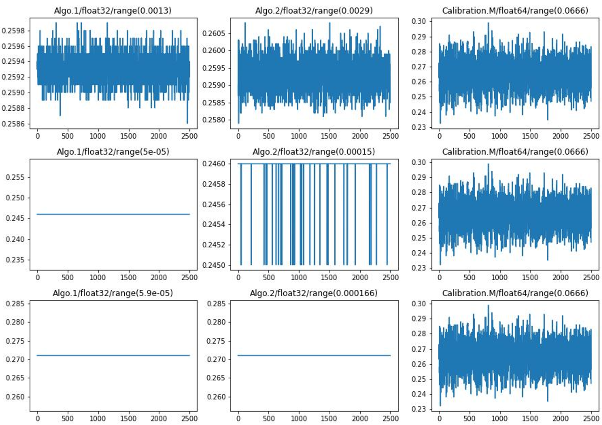
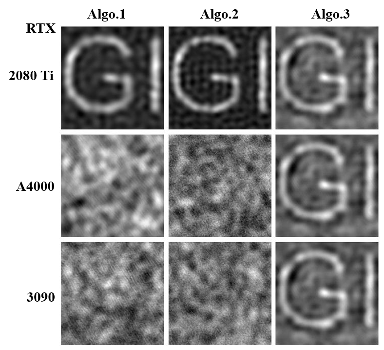

# Solve Mismatch Problem in Compressed Sensing

This repo contains the official implementation for the paper ***Solve Mismatch Problem in Compressed Sensing***.

by Le Yang (2019212184@bupt.edu.cn).

## Abstract

This article proposes a novel algorithm for solving mismatch problem in compressed sensing. Its core is to transform mismatch problem into matched by
constructing a new measurement matrix to match measurement value under
unknown measurement matrix. Therefore, we propose mismatch equation and
establish two types of algorithm based on it, which are matched solution of
unknown measurement matrix and calibration of unknown measurement matrix. Experiments have shown that when under low gaussian noise levels, the
constructed measurement matrix can transform the mismatch problem into
matched and restore original images.

## Methods

We provide three algorithms for constructing measurement matrix $A_{recv}$ to convert mismatched problem into matched problem.

|  Algo.1   | Algo.2  | Algo.3 |
|  :----:  | :----:  | :----: |
|   |  |  |

Then we use the constructed measurement matrix $A_{recv}$ and measurement value $y'$ under
unknown measurement matrix put into compressed sensing algorithm $GPSR$ to restore original images.

## Results
Mismatched Restored images: We use mismatched pair $(y', A)$ to restore original images.


### Exps in the Device with Medium Precision
We collect $M=2500$ speckle patterns ($N=128*128$) from multimode fiber at an offset of 25 as unknown measurement matrix $A_u$, speckle patterns collected from multimode fiber at an offset of 0 as measurement matrix $A$ for pre-measurement. We use GPSR algorithm as compressed sensing recovery. 7 images $x'$ are selected for the experiments. And Experiments (Exps) are implemented with RTX 2080 Ti (11GB), Pytorch. During the experiments, we find that some of the experimental results are related to the precision of the device used, which we will discuss in the next section.

#### Exp0

Iterative loss curves using different `3` **Pre-Measure Images** ($PM_{image}$) for `Algo.1(left)` and `Algo.2(right)`.
|||
|  :----:  | :----:  |
|   |  |

Restored `Baboon` image using constructed $A_{recv}$ by `Algo.1` and `Algo.2` with different `3` $PM_{image}$. 


#### Exp1

Restored all images using constructed $A_{recv}$ by `Algo.1(top)` and `Algo.2(Bottom)` with $PM3$.


Restored all images of different noise levels $\sigma=(0,0.5,1,1.5,2,5)$ using `Algo.2` with $PM3$.


#### Exp3

Restored all images of different noise levels $\sigma=(0,0.5,1,1.5,2)$ using `Algo.3` in **Calibration of Unknown Measurement Matrix Algorithm**.


### The Impact of Device Precision
$\vec{\lambda}$ components curves of three algorithms in three devices. From left to right, the columns represent Algorithm.1, Algorithm.2 and Algorithm.3. From top to bottom, the rows represent RTX2080 Ti, RTXA400, RTX3090. Algorithm.1 and Algorithm.2 calculated by float32, algorithm.3 calculated by float64. Range variable represents the range of components, which is maximum component minus 
minimum component.





## Running Experiments

### Environment

We use the code experiment environment conditions as shown in the following list:

- PyTorch  1.11.0
- Python  3.8 (ubuntu20.04)
- Cuda  11.3
- RTX 2080 Ti (11GB) * 1

### Project structure

```bash
/
├── mmf_displacement # empty folder needs to be replaced with different displacement MMF measurement matrixs downloaded from google drive in the subsection <Data availability>
│   ├── 0 # measurement matrix in 0 displacement MMF
│   │   ├── A_500_256_1.mat  # mmf speckle measurement matrix
│   │   ├── GI_x0y0.mat      # GI Original Image
│   │   ├── y_500_256_1.mat  # Experimental bucket detector value
│   │   └── y_original_500_256_1.mat # Original experimental bucket detector value (before sum)
│   ├── 10 # measurement matrix in 10 displacement MMF. We didn't use in our experiments
│   └── 25 # measurement matrix in 25 displacement MMF
├── timg  # folder including test images and pre-measure images
├── trad_cs_recv_algos # folder containing pytorch implementation of two traditional compressed sensing algorithms, which are OMP and GPSR
│   │── __init__.py  # export module and include a method to get dct transform matrix for sparse transformation
│   │── GPSR_Basic.py # GPSR algorithm for compressed sensing. We used in our experiments
│   └── OPM_recv.py  # OMP algorithm for compressed sensing. We didn't use in our experiments
├── results # empty folder needs to be replaced with results of exps downloaded from google drive in the subsection <Results of Exps>. Or you can run code to save results of exps
├── __init__.py # core implementation of Mismatch Equation and Iterative Algorithm in the paper
├── mmf_speckle.py  # read test images, pre-measure images, and different displacement MMF measurement matrixs
├── recv-mismatch.ipynb # reconstruction of mismatched pairs input into GPSR
├── without-nosie.ipynb # Exp0, Exp1 of algo.1 and algo.2
├── nosie.ipynb # Exp2 of algo.1 and algo.2
├── recv-exps.ipynb # reconstruction of matched pairs constructed by Exp0,Exp1,Exp2 input into GPSR
├── calibration-M.ipynb # implementation and reconstruction of Exp3, which algorithm in the <<B. Calibration of unknown measurement matrix——B.2 Unknow Images in M-Space>> of paper
├── calibration-N.ipynb # implementation and reconstruction of algorithm in the <<B. Calibration of unknown measurement matrix——B.1 Unknow Images in N-Space>> of paper
├── multiply-test.ipynb # show Multiplicity Property of constructed measurement matrix A_recv 
├── README.md
```

## Data availability

Different displacement MMF measurement matrixs at https://drive.google.com/drive/folders/1_RlwkPU6pSR6FRqWL7TT7ovwtphenpcy?usp=drive_link. Download and replace the `/mmf_displacement` folder.

## Results of Exps

We do four different experiments in the paper and save their constructed measurement matrix $A_{recv}$ and corresponding measurement value $y_u$ of the unkown measurement matrix $A_u$ at https://www.kaggle.com/datasets/yanglebupt/mismatch-solution. You can download it and replace the folder as follows. 
```
mismatch-solution/results  --> /results
mismatch-solution-exp2-x/exp2-x  --> /results/exp2-x
```
Then you can run $GPSR$ algorithm in `recv-exps.ipynb` and `calibration-M.ipynb?#recv`. You can also try other compressed sensing algorithms to restore original images.

## Notes

We suggest that you have **sufficient storage** to store the various results of constructed $A_{recv}$ when running the experiments. **Otherwise, you need to change the code to an unsaved form and directly use the constructed** $A_{recv}$ **to restore images and show visualization results**.

Because after constructing $A_{recv}$, we don't directly to restore the original images, but instead save them as `.h5` files. And then in another `ipynb` read from those `.h5` files and input into GPSR to restore the original images. This makes it convenient to experiment with other compression sensing algorithms without the need to rerun construction code for $A_{recv}$.

## References

If you find the code/idea useful for your research, please consider citing

```bib
```
